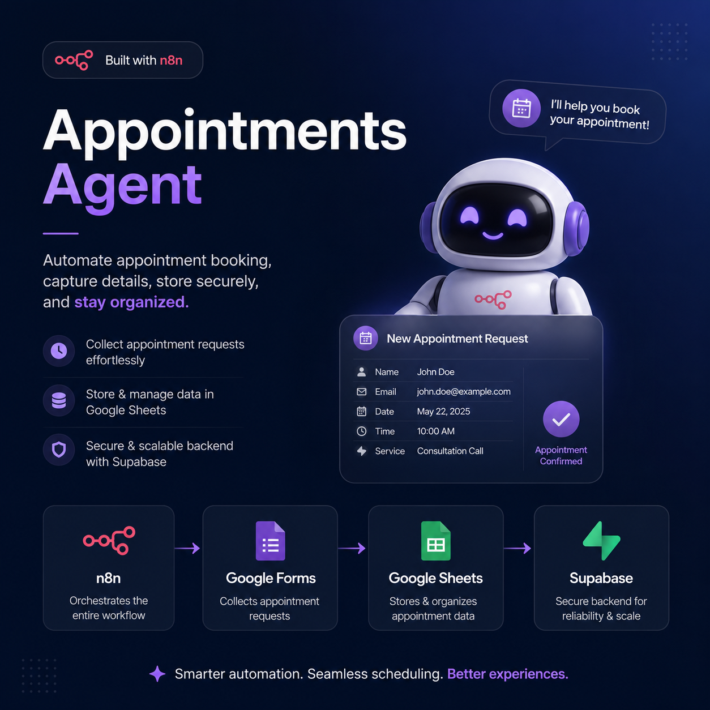

  
# 📅 Appointments Automation Workflow (n8n)
 
This n8n workflow automates appointment booking intake from a **Google Form → Google Sheet**, validates and cleans the submitted data, and stores valid appointments in **Supabase**. Invalid submissions are logged separately for review instead of being dropped silently.
 
---
 
## 🧭 Workflow Overview
 
```
Google Sheets Trigger (new row)
        │
        ▼
   Loop Over Items (batches of 10)
        │
        ▼
   Code in JavaScript (validate + normalize row)
        │
        ▼
        If (is_valid?)
     ┌──true──┐        └──false──┐
     ▼                            ▼
Create a row                Create a row1
(Supabase: appointments)   (Supabase: failed_submissions)
     │                            │
     └────────────┬───────────────┘
                  ▼
         back to Loop Over Items (next batch)
```
 
> 🖼️ See `Images/` for a full screenshot of the workflow canvas as built in n8n.
 
**What it does:**
1. Watches a Google Sheet (linked to a Google Form) for new appointment booking rows.
2. Processes rows in batches of 10 using **Loop Over Items**.
3. Runs each row through a **Code** node that:
   - Normalizes header keys (handles spacing/casing mismatches).
   - Validates full name (no digits, only letters/spaces/`.`/`'`/`-`).
   - Cleans and validates the Indian mobile number (10 digits, strips `+91`/`0` prefixes, must start with 6–9).
   - Validates gender and doctor fields are present.
   - Validates the appointment date is a real date and not in the past.
   - Validates the appointment time matches `HH:MM:SS` format.
   - Generates a `row_hash` (simple hash of name + phone + day + time) for de-duplication.
   - Returns a structured object with `is_valid` and a semicolon-separated `errors` string.
4. An **If** node branches on `is_valid`:
   - **True** → inserts a clean row into the Supabase `appointments` table.
   - **False** → inserts the errors + raw row JSON into the Supabase `failed_submissions` table.
5. Loops back until all batched rows are processed.
---
 
## 🛠️ Part 1 — n8n Installation
 
You can run n8n via **npm**, **Docker**, or **n8n Cloud**. Self-hosted via Docker is recommended for production.
 
### Option A: Docker (recommended)
 
```bash
docker volume create n8n_data
 
docker run -it --rm \
  --name n8n \
  -p 5678:5678 \
  -e GENERIC_TIMEZONE="Asia/Kolkata" \
  -e TZ="Asia/Kolkata" \
  -v n8n_data:/home/node/.n8n \
  docker.n8n.io/n8nio/n8n
```
 
Then open **http://localhost:5678** and complete the first-time owner account setup.
 
### Option B: npm (quick local test)
 
```bash
npm install -g n8n
n8n start
```
 
### Option C: docker-compose (persistent, easier to manage)
 
```yaml
version: "3.7"
services:
  n8n:
    image: docker.n8n.io/n8nio/n8n
    restart: always
    ports:
      - "5678:5678"
    environment:
      - GENERIC_TIMEZONE=Asia/Kolkata
      - TZ=Asia/Kolkata
      - N8N_SECURE_COOKIE=false
    volumes:
      - n8n_data:/home/node/.n8n
 
volumes:
  n8n_data:
```
 
```bash
docker compose up -d
```
 
### Importing this workflow
 
1. Open n8n → **Workflows** → **Add workflow** → **⋮ menu** → **Import from File**.
2. Select `Apointments.json` from this repo.
3. Reconnect the credentials (see below) since credential IDs do not transfer between instances.
---
 
## 🗄️ Part 2 — Supabase Configuration
 
### 2.1 Create a Supabase project
 
1. Go to [supabase.com](https://supabase.com) → **New Project**.
2. Note down your **Project URL** and **service_role / anon API key** (Project Settings → API).
### 2.2 Create the required tables
 
Run this in the Supabase **SQL Editor**:
 
```sql
-- Table for successfully validated appointments
create table public.appointments (
  id uuid primary key default gen_random_uuid(),
  full_name text not null,
  gender text,
  personnel_number text not null,
  doctor text,
  appointment_day date,
  appointment_time time,
  sheet_row_hash text unique,
  created_at timestamptz default now()
);
 
-- Table for rejected / invalid submissions
create table public.failed_submissions (
  id uuid primary key default gen_random_uuid(),
  errors text,
  raw_data jsonb,
  created_at timestamptz default now()
);
```
 
> 💡 `sheet_row_hash` has a `unique` constraint to help prevent duplicate inserts if the same row is processed twice. If you want the workflow to silently skip duplicates instead of erroring, add an `upsert`/`on conflict do nothing` step, or handle it in the Code node.
 
### 2.3 (Optional) Row Level Security
 
If RLS is enabled on your project by default, either:
- Disable RLS for these two tables (simplest, fine for a backend-only automation), **or**
- Add a policy allowing inserts from the `service_role` key (which bypasses RLS by default anyway).
```sql
alter table public.appointments disable row level security;
alter table public.failed_submissions disable row level security;
```
 
---
 
## 🔑 Part 3 — Credentials Configuration in n8n
 
This workflow needs **two credentials**:
 
### 3.1 Google Sheets Trigger (OAuth2)
 
Used by: **Google Sheets Trigger** node.
 
1. In n8n: **Credentials** → **New** → **Google Sheets Trigger OAuth2 API**.
2. Follow n8n's guide to create a Google Cloud OAuth Client (Google Cloud Console → APIs & Services → Credentials → OAuth 2.0 Client ID, type "Web application").
3. Enable the **Google Sheets API** in your Google Cloud project.
4. Add the n8n redirect URI shown in the credential screen to your OAuth Client's **Authorized redirect URIs**.
5. Paste the **Client ID** and **Client Secret** into the n8n credential, then click **Connect my account** and authorize.
6. In the **Google Sheets Trigger** node, select:
   - **Document**: your Google Form's linked response sheet.
   - **Sheet**: `Form responses 1`.
   - **Event**: `Row Added`.
   - **Poll time**: `Every Minute` (adjust as needed).
### 3.2 Supabase API
 
Used by: **Create a row** and **Create a row1** nodes.
 
1. In n8n: **Credentials** → **New** → **Supabase API**.
2. **Host**: your Supabase Project URL (e.g. `https://xxxxx.supabase.co`).
3. **Service Role Secret** (or anon key, if RLS allows inserts): from Supabase → **Project Settings → API**.
4. Save, then attach this credential to both Supabase nodes.
> ⚠️ Treat the **service_role** key as a secret — never commit it to git. Use n8n's credential store (already excluded from the exported workflow JSON) or environment variables if self-managing.
 
---
 
## 🧩 Part 4 — Node-by-Node Build Steps
 
If you're building this workflow from scratch instead of importing the JSON:
 
### 1. Google Sheets Trigger
- Add node **Google Sheets Trigger**.
- Set **Event** = `Row Added`.
- Set **Poll Times** = Every Minute.
- Select the **Document** = your Google Form responses spreadsheet.
- Select the **Sheet** = `Form responses 1`.
- Attach the Google Sheets Trigger OAuth2 credential.
### 2. Loop Over Items (Split In Batches)
- Add node **Loop Over Items** (`n8n-nodes-base.splitInBatches`).
- Set **Batch Size** = `10`.
- Leave **Reset** = off.
- Connect **Google Sheets Trigger → Loop Over Items**.
- This node has two outputs: `done` (index 0) and `loop` (index 1). Connect the **loop** output forward to the Code node — the **done** output is left unconnected (used only when all batches finish).
### 3. Code in JavaScript
- Add a **Code** node, mode = **Run Once for Each Item**.
- Connect **Loop Over Items (loop output) → Code in JavaScript**.
- Paste the validation script (see `Apointments.json` for the exact code), which:
  - Normalizes the incoming Google Form headers via a case/whitespace-insensitive `getField()` helper.
  - Validates: name, phone (Indian 10-digit mobile), gender, doctor, appointment date (not in the past), appointment time format (`HH:MM:SS`).
  - Builds an ISO `appointment_day` (`YYYY-MM-DD`).
  - Computes a `row_hash` for de-duplication.
  - Outputs `{ full_name, gender, personnel_number, doctor, appointment_day, appointment_time, row_hash, is_valid, errors }`.
### 4. If
- Add an **If** node.
- Condition: `{{ $json.is_valid }}` **equals** `true` (string comparison, loose type validation enabled).
- Connect **Code in JavaScript → If**.
### 5. Create a row (Supabase — appointments)
- Add a **Supabase** node named **Create a row**.
- **Table**: `appointments`.
- Map fields:
  | Supabase field | Value |
  |---|---|
  | full_name | `{{ $json.full_name }}` |
  | gender | `{{ $json.gender }}` |
  | personnel_number | `{{ $json.personnel_number }}` |
  | doctor | `{{ $json.doctor }}` |
  | appointment_day | `{{ $json.appointment_day }}` |
  | appointment_time | `{{ $json.appointment_time }}` |
  | sheet_row_hash | `{{ $json.row_hash }}` |
- Connect **If (true output) → Create a row**.
- Attach the Supabase API credential.
### 6. Create a row1 (Supabase — failed_submissions)
- Add a **Supabase** node named **Create a row1**.
- **Table**: `failed_submissions`.
- Map fields:
  | Supabase field | Value |
  |---|---|
  | errors | `{{ $json.errors }}` |
  | raw_data | `{{ JSON.stringify($json) }}` |
- Connect **If (false output) → Create a row1**.
- Attach the same Supabase API credential.
### 7. Close the loop
- Connect **Create a row → Loop Over Items**.
- Connect **Create a row1 → Loop Over Items**.
- This sends control back to **Loop Over Items** so it processes the next batch of 10 rows until the sheet's new rows are exhausted.
### 8. Activate the workflow
- Toggle the workflow **Active** in the top-right corner so the Google Sheets Trigger starts polling every minute.
---
 
## ✅ Testing Checklist
 
- [ ] Submit a test entry via the Google Form.
- [ ] Confirm a new row appears in `Form responses 1`.
- [ ] Confirm the workflow execution runs and completes without errors.
- [ ] Confirm a valid submission lands in the Supabase `appointments` table.
- [ ] Submit an intentionally invalid entry (e.g. bad phone number) and confirm it lands in `failed_submissions` with a populated `errors` field.
---
 
## 📁 Repository Contents
 
```
AppointmentsAgent/
├── Images/              # Screenshot(s) of the full workflow canvas
├── Apointments.json     # Exported n8n workflow (import via n8n UI)
├── APPOINTMENTS.pdf     # This documentation, PDF version
└── README.md            # This documentation, Markdown version
```
 
| File / Folder | Description |
|---|---|
| `Images/` | Screenshot of the entire workflow canvas, for quick visual reference without opening n8n |
| `Apointments.json` | Exported n8n workflow — import this directly into n8n |
| `APPOINTMENTS.pdf` | This documentation as a formatted PDF |
| `README.md` | This documentation in Markdown (renders on GitHub) |