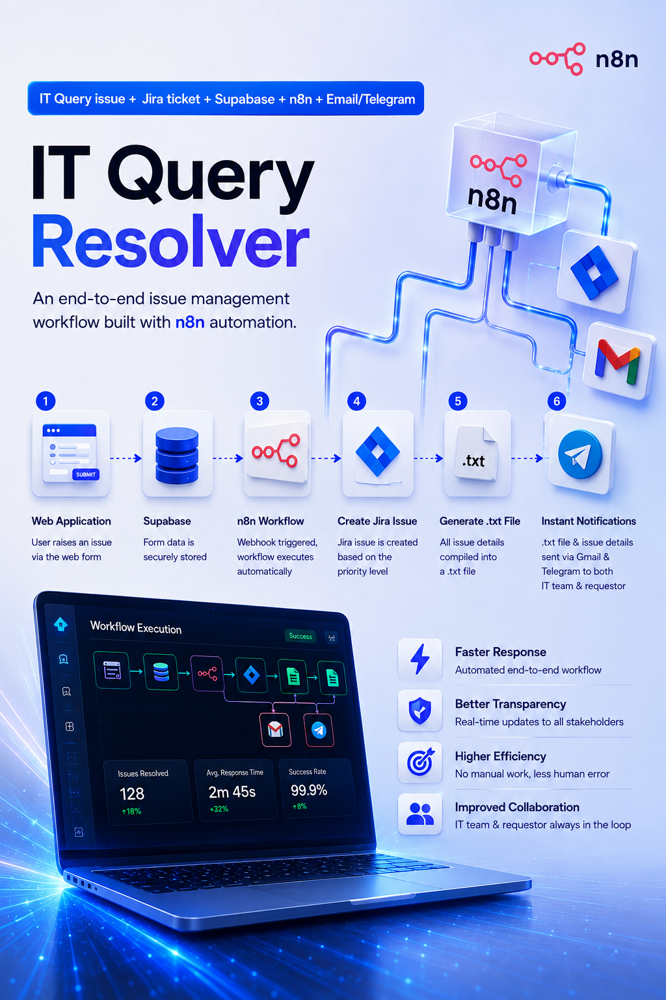

# IT Support System

A minimal, glassmorphic ticket-submission frontend (Next.js + Supabase) wired to a
lean n8n automation that triages every ticket with AI, opens a Jira issue only when
the rules say so, and notifies people over Gmail + Telegram with a plain-text
incident report attached — no PDF renderer, no Docker service, no extra
infrastructure to run.

```
├── it-support-system/        Next.js frontend
├── supabase/schema.sql       Database schema, RLS, storage bucket
└── n8n/
    ├── it-support-workflow.json      Main automation
    └── error-handler-workflow.json   Central error logging + alerting
```

> Detailed node-by-node configuration, credential setup, and API key instructions
> live in **`ITQueryResolverAgent.pdf`** — this README covers the high-level path to a
> working deployment.

## 1. Supabase setup

1. Create a Supabase project.
2. Open the SQL editor and run `supabase/schema.sql`. This creates:
   - `tickets` — the core table, with a `TCK-XXXXXX` auto ID, enums for
     status/priority/category, and columns for AI + Jira + report-URL enrichment.
   - `workflow_logs` — structured log of every automation step (success/error/retry).
   - a public `ticket-attachments` storage bucket (for user uploads and generated
     `.txt` incident reports, stored under a `reports/` prefix).
   - RLS policies: anon can insert/select tickets (no login is used, per current
     design — see "Security notes" below); only the `service_role` key (used by n8n)
     can update tickets or write logs.
3. **Database Webhook** — this is what triggers the whole n8n workflow, no polling:
   - Go to **Integrations → Database Webhooks → Create a new hook**
     (Supabase's Database → Triggers page only lets you call Postgres functions —
     use the dedicated **Database Webhooks** integration page instead).
   - Name: `ticket_created_webhook`
   - Table: `tickets`, Events: **Insert** only
   - Type of webhook: **HTTP Request**
   - Method: `POST`
   - URL: `https://<your-n8n-host>/webhook/ticket-created`
   - Create the webhook.
   - SQL alternative (same effect, run in SQL Editor):
     ```sql
     create trigger ticket_created_webhook
     after insert on public.tickets
     for each row
     execute function supabase_functions.http_request(
       'https://<your-n8n-host>/webhook/ticket-created',
       'POST',
       '{"Content-Type":"application/json"}',
       '{}',
       '5000'
     );
     ```
   - If you're tunneling n8n with **ngrok**, remember the free-tier URL changes on
     every restart — update the webhook URL here whenever that happens.

## 2. Frontend setup

```bash
cd it-support-system
cp .env.example .env.local   # fill in your Supabase URL + anon key
npm install
npm run dev
```

- `/` — dashboard with the "Raise a Query" button → opens the ticket form modal.
- `/history` — look up submitted tickets by email and see live status, AI summary,
  Jira reference, and a link to the generated incident report once available.

Deploy anywhere that supports Next.js (Vercel is the path of least resistance).

## 3. n8n setup

Import both workflows (`n8n/it-support-workflow.json` and
`n8n/error-handler-workflow.json`) via **Workflows → Import from File**.

### Credentials to create in n8n
| Credential | Used by | Notes |
|---|---|---|
| Jira Cloud API (email + API token) | Create Jira Issue | API token from `id.atlassian.com/manage-profile/security/api-tokens`; Domain is your `https://yourcompany.atlassian.net` |
| Gmail OAuth2 | Send Email to Requester / Support Team | If self-hosted, requires a Google Cloud OAuth client with the **Gmail API enabled** and `gmail.send` scope added on the consent screen |
| Telegram bot token | Send Telegram Summary / Report, error alerts | Create via **@BotFather**; get your group's chat ID by adding the bot to the group, sending a message, then hitting `https://api.telegram.org/bot<TOKEN>/getUpdates` |

Full step-by-step screenshots and troubleshooting for each credential are in
**`ITQueryResolverAgent.pdf`**.

### Configuration (no n8n Environments needed)
n8n's **Environments/variables** feature is gated behind a paid plan on n8n Cloud, so
both workflows read their config from a **`Config`** node (a Code node, first thing
after the trigger) instead of `$env.*`. After importing, open the `Config` node in
each workflow and fill in your real values:

```js
// Main workflow's Config node
SUPABASE_URL: 'https://YOUR-PROJECT.supabase.co',
SUPABASE_SERVICE_ROLE_KEY: '...',       // service_role key — never expose to the frontend
SUPABASE_STORAGE_BUCKET: 'ticket-attachments',

GEMINI_API_KEY: '...',                  // https://aistudio.google.com/apikey — free tier

JIRA_PROJECT_ID: '...',
JIRA_ISSUETYPE_BUG_ID: '...',
JIRA_ISSUETYPE_TASK_ID: '...',

TELEGRAM_SUPPORT_GROUP_CHAT_ID: '...',

TEAM_EMAIL_SERVICE_DESK: 'servicedesk@company.com',
TEAM_EMAIL_NETWORK: 'network@company.com',
TEAM_EMAIL_SECURITY: 'security@company.com',
TEAM_EMAIL_INFRASTRUCTURE: 'infra@company.com',
TEAM_EMAIL_APP_SUPPORT: 'appsupport@company.com'
```

The error-handler workflow has its own smaller `Config` node
(`SUPABASE_URL`, `SUPABASE_SERVICE_ROLE_KEY`, `TELEGRAM_SUPPORT_GROUP_CHAT_ID`) —
keep it in sync with the main one.

Downstream nodes read these via `$('Config').first().json.FIELD` instead of
`$env.FIELD`. The Telegram bot token and Jira/Gmail auth aren't here — those stay
as n8n **Credentials** (see table above), which every plan supports.

⚠️ Since these values live in the workflow JSON itself rather than env vars, treat
an exported copy of the workflow (with real values filled in) as a secret — don't
commit it or share it. If you later move to self-hosted n8n or a paid Cloud plan,
you can switch these back to `$env.FIELD` and set them under Settings → Environments.

Then, in the main workflow's **Settings**, point `errorWorkflow` at the imported
error-handler workflow's ID so any node failure (after retries are exhausted) is
logged to `workflow_logs` and posted to your Telegram ops chat automatically.

### Why Gemini, and why no PDF renderer
- **AI provider — Google Gemini (`gemini-1.5-flash`)**: has a genuinely free tier
  (no card required for low volume), unlike OpenAI/Anthropic which are pay-as-you-go.
  Swap the URL/prompt inside the "AI Analysis & Business Rules" node if you'd rather
  use a different model — the rest of the workflow only depends on the JSON shape
  it returns.
- **Incident report — plain `.txt`, not PDF**: earlier versions rendered HTML through
  a self-hosted Gotenberg (Chromium) service. That's an extra container to run and
  keep alive just to make a report look nice. The workflow now builds a formatted
  `.txt` report directly in a Code node and uploads it straight to Supabase Storage
  — zero extra infrastructure, one node instead of four (HTML template → binary
  conversion → Gotenberg call → storage upload). If you want a nicer format later,
  swap the "Build & Upload Report (.txt)" node for a call to a hosted HTML→PDF API;
  everything downstream (email/Telegram attachment, `report_url` column) only
  expects a `data` binary property and a public URL.

### Workflow logic (main workflow)
1. **Webhook** receives the Supabase INSERT payload.
2. **Config** — static values used by every downstream node.
3. **Fetch Full Ticket** re-reads the row from Supabase (decouples the workflow
   from whatever subset of columns the webhook payload includes).
4. **AI Analysis & Business Rules** (single Code node) normalizes the row, calls
   Gemini for classification/severity/summary/recommended team, and applies
   configurable rules (edit the `HIGH_PRIORITIES` / `FORCE_JIRA_CATEGORIES` arrays
   in that node) to decide `jira_required`: High/Critical priority, Security or
   Infrastructure category, or the AI recommends it.
5. **Update Ticket: AI Fields** writes the AI output back; status flips to
   **In Progress**.
6. **IF: Jira Required?** branches:
   - **true** → **Create Jira Issue** (project, issue type, summary, description
     all populated from the ticket + AI output — see PDF for the Priority/Labels
     field quirks) → **Save Jira Key to Supabase**.
   - **false** → **No Jira Needed** (No-Op passthrough).
7. **Merge Branches** (mode: **Append**, *not* "Wait for All Inputs") recombines
   the two mutually-exclusive branches back into one stream.
8. **Build & Upload Report (.txt)** formats a plain-text incident report, uploads
   it to the `ticket-attachments` bucket under `reports/`, and resolves the
   recommended team's mailbox from the Config values — all in one node.
9. **Fan-out in parallel, all connected directly off step 8** (see PDF — this
   matters, chaining them in series loses the binary attachment and ticket
   fields along the way):
   - **Update Ticket: Report URL** — persists `report_url` + status to Supabase.
   - **Send Email to Requester** / **Send Email to Support Team** — Gmail, with
     the `.txt` report attached.
   - **Send Telegram Summary** / **Send Telegram Report** — formatted message to
     the ops group, then the report as a Telegram document.

### Reliability
- Every external-integration node (Supabase, Gemini, Jira, storage upload) has
  `retryOnFail` with 2–3 attempts and a backoff delay.
- Notification nodes (Gmail, Telegram) use `continueOnFail: true` so a broken
  Telegram bot token, say, never blocks the email that already went out, or vice
  versa — everything is independently configurable and independently failing.
- The separate **Error Handler** workflow catches anything that still fails after
  retries, logs it to `workflow_logs` with the failing step name, and pings your
  Telegram ops chat so nothing fails silently. Per-step success logging inside the
  main workflow was removed to cut node count — `workflow_logs` now only fills in
  on failure, and Supabase's own `updated_at`/`status` columns cover the happy path.

## Security notes
- The frontend uses only the Supabase **anon** key and never the service role key.
- Ticket updates (AI fields, Jira key, report URL, status) are restricted to the
  `service_role` key via RLS — the frontend can create and read tickets, but only
  n8n can mutate the enrichment fields.
- No login is implemented per current scope, so ticket history is looked up by
  email rather than session — if you later add Supabase Auth, swap the `tickets`
  SELECT policy to check `auth.jwt() ->> 'email' = email` for real isolation, and
  the frontend code needs no other changes since it already filters by email.
- Never commit real API keys/tokens — everything above is read from env vars or
  the n8n Config node, never hardcoded in the repo.

## Troubleshooting quick reference
| Symptom | Cause | Fix |
|---|---|---|
| Jira 400 "priority selected is invalid" | Project's issue screen has no Priority field enabled | Remove the Priority field from the Create Jira Issue node |
| Jira 400 "Specify the value for Labels in an array" | n8n serializes the Labels expression as a string, not an array | Remove the Labels field, or verify your n8n version renders it as a true multi-value list |
| Email/Telegram "undefined" recipient or "no binary file found" | Node is chained after another node (e.g. an HTTP/Gmail send) that strips JSON fields or binary from the item | Connect notification nodes directly off **Build & Upload Report (.txt)** instead of daisy-chaining them |
| Merge Branches outputs nothing | Mode set to "Wait for All Inputs to Arrive" while only one IF branch ever fires | Set Mode to **Append** |
| Gmail node: "Forbidden - perhaps check your credentials?" | Credential not attached to the node, or Gmail API not enabled in the Google Cloud project | Select the credential explicitly on the node; enable the Gmail API at `console.cloud.google.com/apis/library/gmail.googleapis.com` |
