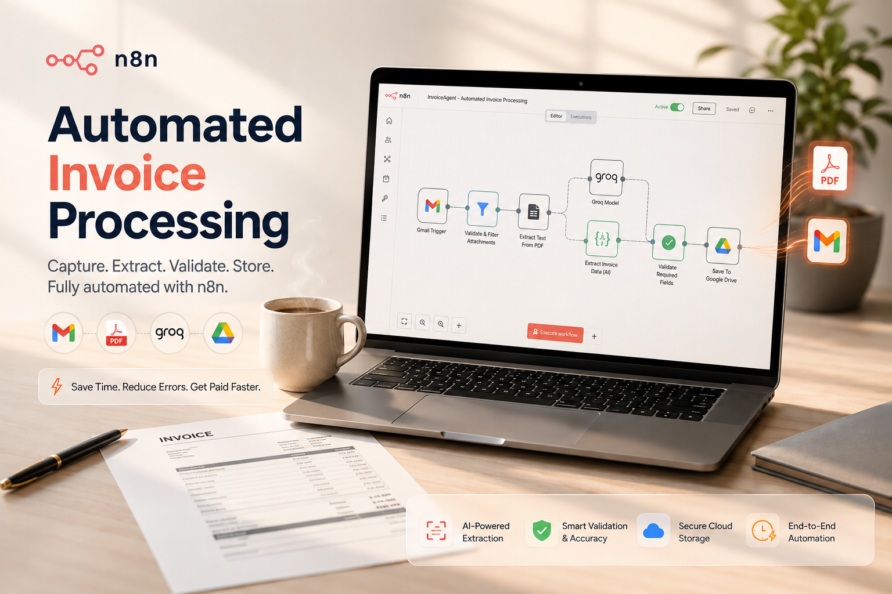

  

# InvoiceAgent — Automated Invoice Processing

Watches Gmail for invoice PDFs, extracts structured data with an LLM (Groq), files
the original PDF in Google Drive, and logs the extracted data in Supabase —
skipping anything that isn't a real invoice.

## Files
| File | Purpose |
|---|---|
| `invoice_processing_workflow.json` | Importable n8n workflow |
| `invoice_workflow.ts` | n8n Workflow SDK source |
| `supabase_schema.sql` | `invoices` table schema |
| `.env.example` | Credentials needed per integration |

## Nodes, in detail

### 1. Gmail Trigger
Polls Gmail every minute with the search filter `has:attachment filename:pdf
newer_than:1d` — only emails with a PDF attached from the last day are
considered, so the workflow doesn't wade through your whole inbox. "Download
Attachments" is enabled in its options, which pulls the PDF bytes into binary
data on the item rather than just a reference.

### 2. Validate & Filter Attachments (Code)
The trigger can emit an email with zero, one, or several attachments. This node
loops over every binary attachment on the item and keeps only the ones that are
`application/pdf` **and** whose filename or email subject matches
`/invoice|receipt|bill|statement/i`. Anything else — a signed contract PDF, a
marketing flyer, a non-PDF attachment — is dropped. If nothing survives, the
node returns an empty array, which cleanly stops the workflow for that run
instead of erroring.

### 3. Extract Text From PDF
Built-in **Extract From File** node, `operation: pdf`. Converts the PDF binary
into plain text (`$json.text`) so the LLM has something to read — LLMs can't
read raw PDF bytes directly through this node type.

### 4. Extract Invoice Data (AI)
An **Information Extractor** node paired with a **Groq Chat Model**
(`llama-3.1-8b-instant`) as its language-model subnode. It's given a manual
JSON Schema describing exactly the shape we want back: `is_invoice` (boolean),
`vendor`, `invoice_number`, `invoice_date`, `due_date`, `currency`, `subtotal`,
`tax`, `total_amount`, `payment_status`, `description`. The system prompt
instructs the model to set `is_invoice: false` and leave fields null rather
than guess, if the document doesn't actually look like an invoice — this is
what lets a random PDF fail safely instead of producing fabricated numbers.

### 5. Parse & Validate Extraction (Code)
The safety gate. Reads the AI's structured output and:
- Throws (stopping the workflow) if `is_invoice` isn't `true`.
- Throws if any of `vendor`, `invoice_number`, `total_amount`, `currency` is
  missing — these are the fields storage can't function without.
- Sanitizes vendor/invoice-number strings and builds the Drive filename in the
  format `Vendor_InvoiceNumber_Date.pdf`.

Nothing downstream of this node ever sees an invalid extraction.

### 6. Upload to Google Drive
Uploads the original PDF binary (untouched — this is the source document, not
AI output) into a configured `Invoices` folder, named using the filename built
in step 5. Keeps the original file addressable by URL for step 7.

### 7. Insert Invoice (Supabase)
Writes one row into the `invoices` table: every extracted field, plus the
Drive file's `webViewLink` and file ID so the original document stays
reachable from the database record. Two things make this idempotent:
- `unique(vendor, invoice_number)` in `supabase_schema.sql` rejects a literal
  duplicate at the database level.
- `onError: continueRegularOutput` on this node means a duplicate-key failure
  is absorbed quietly instead of crashing the workflow — re-processing the
  same email twice doesn't create two rows or throw an error the user has to
  chase down.

## Setup checklist
- [x] Gmail, Supabase, Groq credentials connected
- [ ] Google Drive OAuth2 credential
- [ ] Replace `REPLACE_WITH_INVOICES_FOLDER_ID` in "Upload to Google Drive"
- [ ] Run `supabase_schema.sql` against your Supabase project
- [ ] Activate the workflow

## Why Groq needed a different node than OpenAI
The original design used an AI Agent + Structured Output Parser (tool-calling).
Groq's function-calling API is stricter than OpenAI's and returned `400 Bad
Request` whenever the model had to return real field values. The **Information
Extractor** node does structured extraction in a single call and works
reliably with Groq — that's what this workflow uses.
