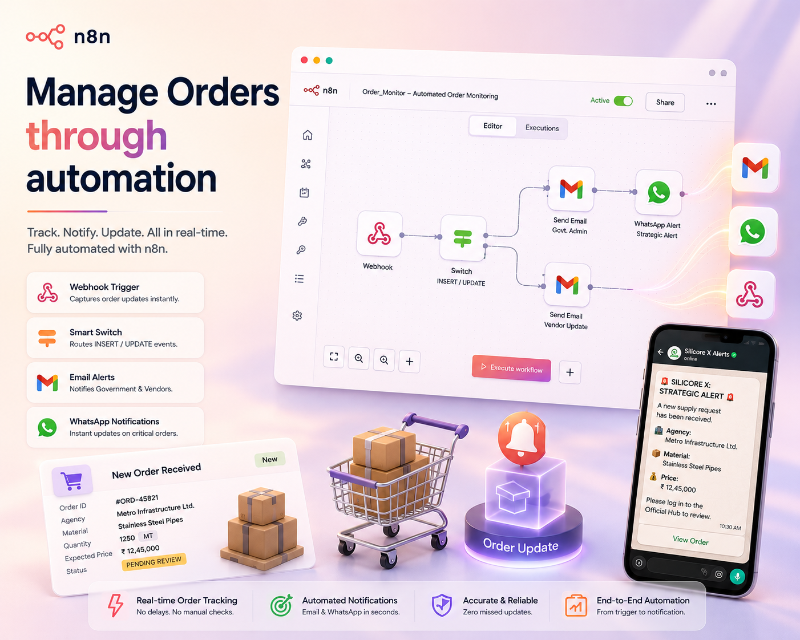

# Order Monitor Agent

An n8n workflow that watches the **Silicore X** Supabase database for new supply
requests and status changes, then automatically notifies the right people —
government admin, vendor, or both — by email and WhatsApp. It removes the need
for anyone to manually poll the database for order activity.

## Context: what problem this solves
Agencies submit raw-material supply requests into a Supabase table. Vendors
and government admins then update the status of those requests (e.g.
negotiating, approved, rejected). Without automation, both sides have to keep
refreshing a dashboard to know something changed. This workflow turns every
insert/update into an instant push notification.

## Trigger
Supabase is configured to call this workflow's **Webhook** node on every
`INSERT` or `UPDATE` to the supply-request table (via a Postgres/DB webhook
or Realtime hook). The webhook responds immediately with "Workflow got
started" so Supabase doesn't wait on downstream email/SMS sending.

## Workflow logic (brief)
```
Webhook  →  Switch  →  (INSERT) → Send a message (Gmail, admin)
                                → Send an SMS/MMS/WhatsApp message (Twilio)
                     →  (UPDATE) → Send a message1 (Gmail, vendor)
```
1. A record change lands on the webhook as JSON: `{ type, record }`.
2. **Switch** reads `body.type` and picks a branch:
   - **`INSERT`** — a brand-new supply request was created.
   - **`UPDATE`** — an existing request's status changed.
   - Anything else is ignored (no branch matches, run ends quietly).
3. Each branch fires one or two notification nodes with the record's fields
   interpolated into the message (material, quantity, price, status, etc).

## Nodes, explained

**Webhook** (`n8n-nodes-base.webhook`)
The entry point. Listens for `POST` requests at `supabase-order-update`.
Needs no credentials — Supabase calls it directly as an HTTP callback.

**Switch** (`n8n-nodes-base.switch`)
A two-rule router with no fallback. Rule 1 matches `body.type == "INSERT"`
and sends output down branch 0. Rule 2 matches `body.type == "UPDATE"` and
sends output down branch 1. This is what decides "new request" vs "status
update" handling.

**Send a message** (`n8n-nodes-base.gmail`) — *INSERT branch*
Emails the government admin (`governmentadmin2@gmail.com`) that a new supply
request has arrived, with agency name, material, quantity, and expected
price pulled from `$json.body.record`.

**Send an SMS/MMS/WhatsApp message** (`n8n-nodes-base.twilio`) — *INSERT branch*
Runs in parallel with the admin email. Sends a WhatsApp message via Twilio's
sandbox sender to a fixed number, summarizing the same new-request details
so admins get a mobile-first alert even if they miss the email.

**Send a message1** (`n8n-nodes-base.gmail`) — *UPDATE branch*
Emails the vendor (`testvendor2108@gmail.com`) whenever the request's status
changes, showing the current status plus quantity/price, and pointing them
to the Vendor Hub to respond to any counter-offer.

## Folder contents
```
OrderMonitorAgent/
├── README.md               this file
├── workflow/
│   └── Order_Monitor.json    exportable n8n workflow
└── config/
    └── node_config.md        per-node parameter table, credentials, payload schema
```

## Setup
1. Import `workflow/Order_Monitor.json` into n8n.
2. Attach a **Gmail OAuth2** credential to both Gmail nodes (`Send a message`,
   `Send a message1`).
3. Attach a **Twilio** credential to `Send an SMS/MMS/WhatsApp message`.
4. Point the Supabase DB Webhook (or Realtime trigger) at this workflow's
   webhook URL, sending payloads shaped as described in `config/node_config.md`.
5. Activate the workflow.

## Source
Exported from the live n8n workflow **Order_Monitor** (id `vtmuhoReURVGvESN`).
