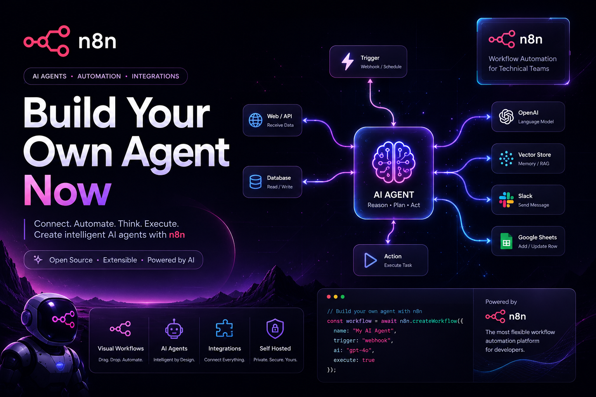

# n8n Agents
 
A collection of AI-powered automation agents built using [n8n](https://n8n.io) — combining workflow automation with LLM-driven decision making, tool use, and memory.
 
---
 
## 📖 What is n8n?
 
**n8n** (pronounced "n-eight-n," short for "nodemation") is an open-source workflow automation tool. It lets you connect apps, APIs, databases, and AI models together using a visual, node-based editor instead of writing everything from scratch in code.
 
Key characteristics:
 
- **Visual workflow builder** — drag-and-drop nodes to define triggers, logic, and actions.
- **Open source & self-hostable** — run it locally, on your own server, or use n8n Cloud.
- **400+ integrations** — connects to services like Gmail, Slack, Notion, Airtable, Google Sheets, and more.
- **Native AI support** — built-in nodes for LLMs (OpenAI, Anthropic, local models via Ollama), vector stores, memory, and AI Agents.
- **Extensible** — supports custom code (JavaScript/Python), webhooks, and community nodes.
In short: n8n is the glue that lets you automate repetitive tasks and build intelligent, multi-step workflows without needing a full backend.
 
---
 
## ⚙️ How to Install
 
### Option 1: npm (quickest for local use)
 
```bash
npm install n8n -g
n8n start
```
 
n8n will be available at `http://localhost:5678`.
 
### Option 2: Docker (recommended for self-hosting)
 
```bash
docker volume create n8n_data
 
docker run -it --rm \
  --name n8n \
  -p 5678:5678 \
  -v n8n_data:/home/node/.n8n \
  docker.n8n.io/n8nio/n8n
```
 
### Option 3: Docker Compose (recommended for persistent, production-like setups)
 
```yaml
version: "3.7"
services:
  n8n:
    image: docker.n8n.io/n8nio/n8n
    restart: unless-stopped
    ports:
      - "5678:5678"
    environment:
      - N8N_BASIC_AUTH_ACTIVE=true
      - N8N_BASIC_AUTH_USER=admin
      - N8N_BASIC_AUTH_PASSWORD=changeme
    volumes:
      - n8n_data:/home/node/.n8n
 
volumes:
  n8n_data:
```
 
```bash
docker compose up -d
```
 
### Option 4: n8n Cloud
 
If you don't want to self-host, sign up at [n8n.io](https://n8n.io) for a managed instance.
 
---
 
## 🤖 What are n8n Agents?
 
**n8n Agents** are workflows built around the **AI Agent node**, which turns a normal automation workflow into a reasoning system. Instead of following a fixed, linear sequence of steps, an agent:
 
1. **Receives a goal or input** (a message, a trigger, a voice command, etc.)
2. **Reasons about what to do** using an LLM (e.g., GPT, Claude, or a local model)
3. **Chooses and calls tools** — other n8n nodes, APIs, or external services — to gather information or take action
4. **Uses memory** (buffer memory, vector stores, or databases) to retain context across steps or conversations
5. **Returns a response or completes an action** based on the results
### Core building blocks of an n8n Agent workflow
 
| Component | Purpose |
|---|---|
| **Trigger node** | Starts the workflow (webhook, chat message, schedule, form submission) |
| **AI Agent node** | The reasoning core — decides what actions to take |
| **Chat Model node** | The LLM powering the agent (OpenAI, Anthropic, Ollama, etc.) |
| **Tool nodes** | Actions the agent can call (search, calculator, HTTP request, custom code, other workflows) |
| **Memory node** | Keeps track of conversation history or context (window buffer, Redis, Postgres) |
| **Output/Response node** | Sends the final result back (chat reply, email, Slack message, etc.) |
