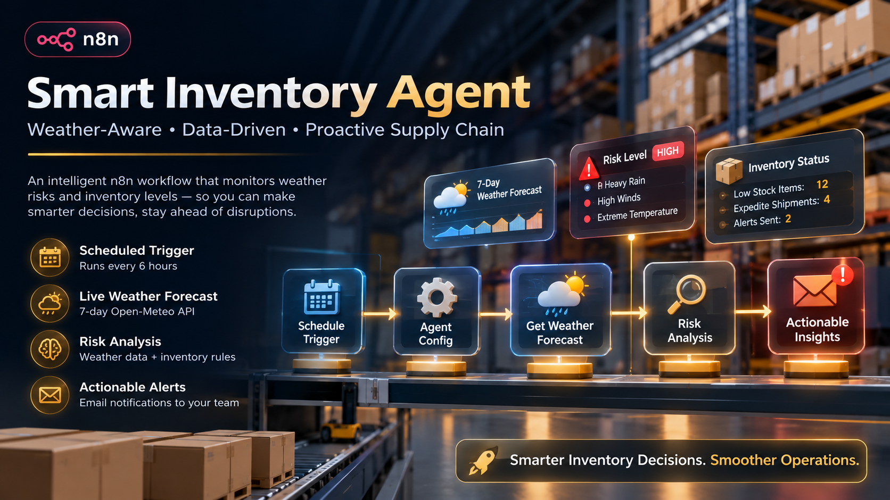

# Smart Inventory Agent (n8n)

Weather-aware inventory management for a warehouse or distribution point.
On a schedule, this n8n workflow pulls a 7-day weather forecast for a given
location, scores the upcoming shipping/operational risk (storms, heavy
rain, high wind, extreme temperatures), cross-references that risk against
current stock levels in Supabase, and:

- flags low-stock items that should be **expedited / shipped faster**
  ahead of bad weather,
- computes a **recommended reorder quantity** for anything running low,
- writes the results back into `inventory_items` so existing
  dashboards/ops tooling can read the flags directly,
- emails a summary report every run, so there's a paper trail of what the
  agent saw and decided.

The core idea: weather disruption and low stock are each individually
manageable, but the combination is when shipments actually get missed.
This agent catches that combination automatically instead of relying on
someone checking the forecast before it becomes a problem.

---

## How it works

```
Schedule Trigger
   └─▶ Agent Config                    (location, coordinates, table name, thresholds)
          └─▶ Get Weather Forecast     (Open-Meteo, 7-day daily forecast)
                 └─▶ Analyze Weather Risk   (score rain/wind/temp/storm codes → risk level)
                        └─▶ Get Inventory Items   (Supabase rows for this location)
                               └─▶ Compute Inventory Actions   (per-item expedite/reorder decision)
                                      ├─▶ Needs Update? ─▶ Update Inventory (Supabase)
                                      └─▶ Build Report ─▶ Send Report Email
```

Ten nodes, no external orchestration needed. Weather data comes from
[Open-Meteo](https://open-meteo.com/) — free, keyless, no rate-limit
headaches for a workflow running a few times a day. Inventory lives in a
plain Supabase Postgres table, so anything else already reading/writing
that table keeps working unmodified — this agent only owns a handful of
extra columns (see `docs/SETUP.md` for the full schema).

---

## Repo structure

```
SmartInventoryAgent/
├── README.md                      you are here
├── sql/
│   └── 01_inventory_schema.sql    inventory_items table, seed rows, RLS policy
├── workflow/
│   └── SmartInventoryAgent.json   the n8n workflow — import this, or it's
│                                  already pushed live via the n8n API
└── docs/
    └── SETUP.md                   setup walkthrough + node-by-node
                                    configuration reference + troubleshooting
```

`docs/SETUP.md` is the reference manual — read it before changing any
node. This README is the overview.

---

## Quick start

1. Run [`sql/01_inventory_schema.sql`](sql/01_inventory_schema.sql) in your
   Supabase project's SQL editor. Creates `inventory_items` and seeds four
   sample rows for `"Mumbai Warehouse"`.
2. Import [`workflow/SmartInventoryAgent.json`](workflow/SmartInventoryAgent.json)
   into n8n (Workflows → Import from File), or confirm it's already
   present if it was pushed in via the n8n REST API.
3. Attach your Supabase and Gmail credentials to the relevant nodes (see
   [docs/SETUP.md](docs/SETUP.md)).
4. Open `Agent Config` and set your real `location_name`, `latitude`, and
   `longitude`.
5. Click **"Execute workflow"** once to test. Confirm the Supabase rows
   update and the report email arrives.
6. Toggle the workflow **Active**. Runs every 6 hours by default
   (cron `0 */6 * * *`).

---

## Data flow, in brief

1. **`Agent Config`** centralizes location/coordinates/table
   name/thresholds — n8n's free/cloud plans block Code nodes from reading
   real environment variables, so config lives on this node instead.
2. **`Get Weather Forecast`** calls Open-Meteo for max/min temperature,
   precipitation sum/probability, max wind speed, and weather code for the
   next 7 days.
3. **`Analyze Weather Risk`** scores each day against rain/wind/temp/storm
   thresholds, sums into `risk_score`, and buckets it into `NONE / LOW /
   MODERATE / HIGH / SEVERE` — plus a human-readable list of *why* (e.g.
   "Heavy rain expected 2026-08-18 (48mm, 90% chance)") that flows through
   to both the email and the Supabase rows.
4. **`Get Inventory Items`** pulls every row for the configured location.
5. **`Compute Inventory Actions`** combines each row with the risk
   assessment: low stock + high/severe risk → `expedite_shipping = true`;
   low stock alone → `LOW_STOCK_ONLY`; neither → `NORMAL`. Also computes a
   recommended reorder quantity for anything below threshold.
6. The results split: **`Needs Update?` → `Update Inventory`** writes back
   only rows needing action, while **`Build Report` → `Send Report Email`**
   sees every item (via `executeOnce`) and sends one combined summary.

---

## The risk model, briefly

Each of the next 7 forecast days is scored against rainfall, wind speed,
temperature extremes, and WMO weather codes for storms/heavy
precipitation; points sum into a `risk_score` for the week:

```
score >= 8   →  SEVERE
score >= 5   →  HIGH
score >= 2   →  MODERATE
score >= 1   →  LOW
score == 0   →  NONE
```

Expedited shipping only fires on `HIGH`/`SEVERE` risk **and** stock at or
below `reorder_threshold × low_stock_multiplier` — the agent only acts on
the combination that actually threatens a missed shipment, not on either
signal alone. Exact thresholds and how to tune them (more conservative vs.
more aggressive) are in
[docs/SETUP.md § Tuning the risk model](docs/SETUP.md#7-tuning-the-risk-model).

---

## What gets written back, and the email report

Only rows needing action get updated, and only on columns the workflow
owns: `expedite_shipping`, `priority_level`, `weather_risk_level`,
`weather_risk_reasons`, `recommended_reorder_qty`, `last_weather_check`.
`sku`, `item_name`, `stock_quantity`, `reorder_threshold` are treated as
input the agent reads but never modifies.

Every run also sends one HTML email — location, timestamp, overall risk
level and reasons, and (if anything's flagged) a table of SKU/name/stock/
priority/expedite-flag/recommended-reorder-qty. It sends even when nothing
is flagged, so silence from this workflow is itself informative — if the
emails stop, something's wrong with the schedule, not just "nothing to
report." See [docs/SETUP.md § Swapping the notification channel](docs/SETUP.md#8-swapping-the-notification-channel)
to route this to Slack/Telegram/SMS instead.

---

## Multi-location setup

Duplicate the chain from `Agent Config` through `Send Report Email` once
per location, all fed by the same `Schedule Trigger`. Give each duplicate
a distinct name and its own coordinates — branches stay scoped to their
own rows via the `location_name` filter, so they never collide. For a
large number of locations, consider converting `Agent Config` into a
Supabase-backed `locations` table and looping over it instead — a bigger
structural change than this template covers out of the box.

---

## Design decisions

- **Open-Meteo over a paid weather provider** — no API key, no billing
  surprises, accurate enough for a 7-day operational-risk signal.
- **Risk scoring lives in a Code node**, not a separate service — keeps
  the agent self-contained in one importable file. Fine for a
  threshold-based heuristic; would need to move out if this grew into a
  proper ML model.
- **Write-back is row-scoped, not table-scoped** — only rows needing
  action get touched, so `last_weather_check` means "last time this item
  needed attention," not "last time the agent ran."
- **One email per run, always sent** — intentional liveness signal.

---

## Extending the agent

Roughly in order of effort: only alert when `flagged_count > 0` (add an
`IF` before the email); auto-create purchase orders when
`expedite_shipping` is true; log a `weather_risk_history` row every run
instead of overwriting the latest value, for trend charts; route `SEVERE`
risk to Slack/SMS and everything else to email digest via a Switch node;
move to a locations-table + loop for scaling past a handful of manually
duplicated branches.

---

## Note on "workflow in n8n"

This workflow lives in two places, meant to stay in sync: **this repo**
(`workflow/SmartInventoryAgent.json`) is the portable, version-controlled
source of truth; **your running n8n instance** is where it actually
executes. If you edit nodes directly in the n8n UI or push changes through
its API, pull those changes back into this file afterward so the repo
doesn't drift from what's deployed. There's no third-party hosted n8n this
assistant can reach on its own — either the workflow is imported manually,
or pushed directly into a specific, user-provided instance (URL + API key)
as was done here.
