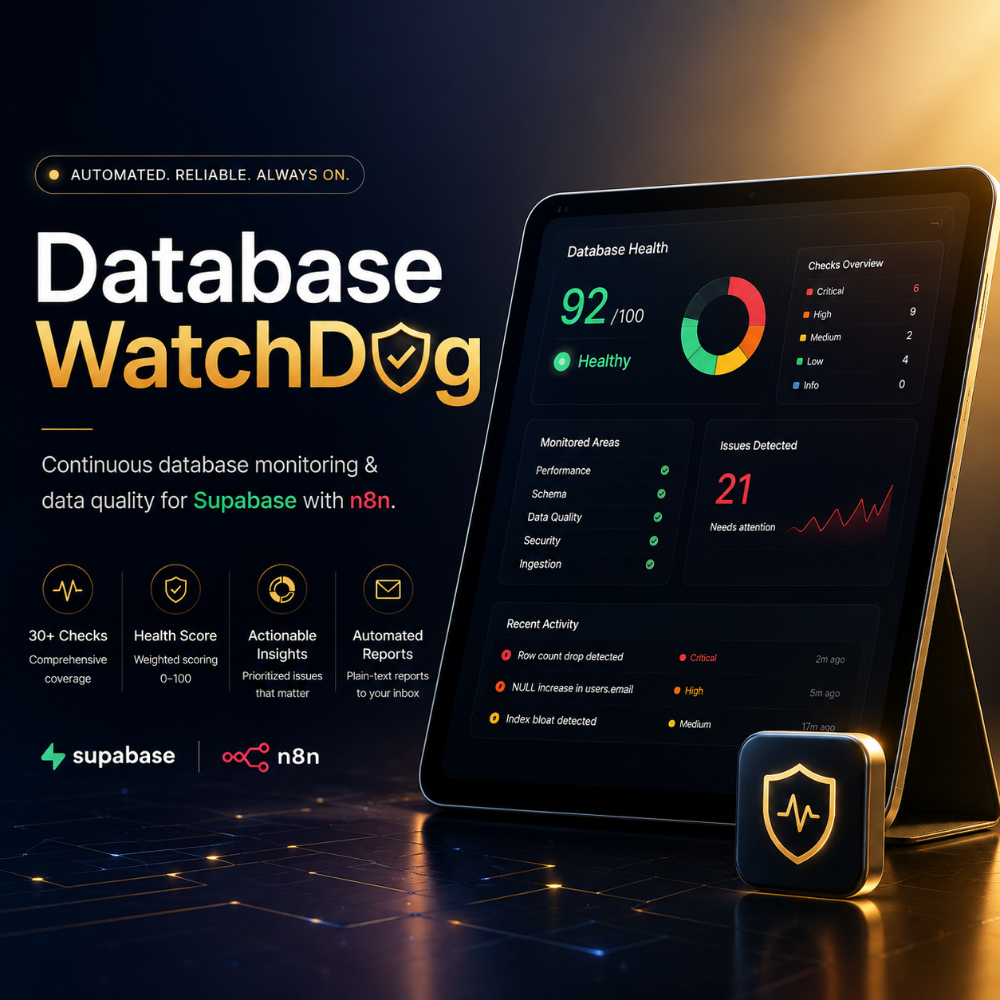

  

# Supabase Database Monitoring & Data Quality (n8n)

Automated health and data-quality monitoring for a single Supabase project.
On a schedule, n8n calls one Postgres function to profile every table,
scores the database, stores history, and emails a plain-text report.

**Why it exists:** catch schema drift, silent data-quality regressions (NULLs
creeping up, duplicates, orphaned rows), ingestion stalls, and index/bloat
problems — without hand-writing a query per table or per metric.

**How it stays small:** discovery + profiling live in one `SECURITY DEFINER`
Postgres function (`mon_collect()`), so the n8n side is just orchestration —
12 nodes regardless of how many tables you have.

```
Schedule ─▶ Monitor Config ─▶ Prepare Run ─▶ Central: Bootstrap ─▶ Build Project Queue
   ─▶ Project: Collect ─▶ Analyze Project ─▶ Compose Report
   ─▶ Central: Persist Run ─▶ Build .txt Attachment ─▶ Email Report
```

`Monitor Config` holds the project URL/key/report recipient — n8n's
free/cloud plan blocks Code nodes from reading environment variables, so
config is entered on that node and passed down instead. See
**[docs/SETUP.md](docs/SETUP.md)** for exact per-node setup steps.

## What it checks

Schema drift, row-count/size anomalies, NULL rates, duplicates, orphaned
foreign keys, bad timestamps, ingestion freshness/drops/spikes, unused or
invalid indexes, table bloat, stale planner stats, and project reachability
— about 30 check types total, each with tunable thresholds. Full reference:
[docs/CHECKS.md](docs/CHECKS.md).

## Health score

```
penalty = Σ (CRITICAL 25, HIGH 10, MEDIUM 4, LOW 1.5, INFO 0)
damped  = penalty <= 40 ? penalty : 40 + sqrt(penalty - 40) * 6
score   = clamp(100 - damped, 0, 100)     grade: A>=90 B>=75 C>=60 D>=40 F<40
```

Damping keeps a pile of LOW-severity noise from crushing the score, while a
couple of CRITICALs still hurt badly.

## Repo structure

```
sql/                          SQL to run on your Supabase project (in order)
  01_central_store.sql          history tables + mon_bootstrap() + mon_persist_run()
  02_collector_rpc.sql          mon_collect() — the discovery/profiling function
  03_seed_rules_and_projects.sql default rules + registers your one project
workflow/
  src/*.js                      readable source for each n8n Code node
  build_workflow.py             assembles workflow/workflow.json from src/
  workflow.json                 import this into n8n (placeholders only — safe to commit)
  test/harness.js               offline test of the Code nodes, no n8n/DB needed
docs/
  SETUP.md                      step-by-step config for every node
  CHECKS.md                     full list of checks + thresholds
.env.example                    reference for which values go on the Monitor Config node
```

## Quick start

1. Run the three `sql/*.sql` files, in order, in your Supabase SQL editor.
2. Import `workflow/workflow.json` into n8n.
3. Follow [docs/SETUP.md](docs/SETUP.md) to fill in each node.
4. Run once manually, check the emailed report, then activate the schedule.

## Local testing

```bash
cd workflow && node test/harness.js
```

Runs all Code nodes against a mock snapshot — no database, no n8n. Edit
`workflow/src/*.js`, then `python build_workflow.py` to regenerate
`workflow.json`.

## Security note

No secrets are stored in this repo. `Monitor Config`'s values live only
inside your n8n instance once you fill them in there — `workflow.json` in
git keeps placeholder values. Don't paste real keys into `sql/*.sql`,
`.env.example`, or export a workflow with real values into this repo.
