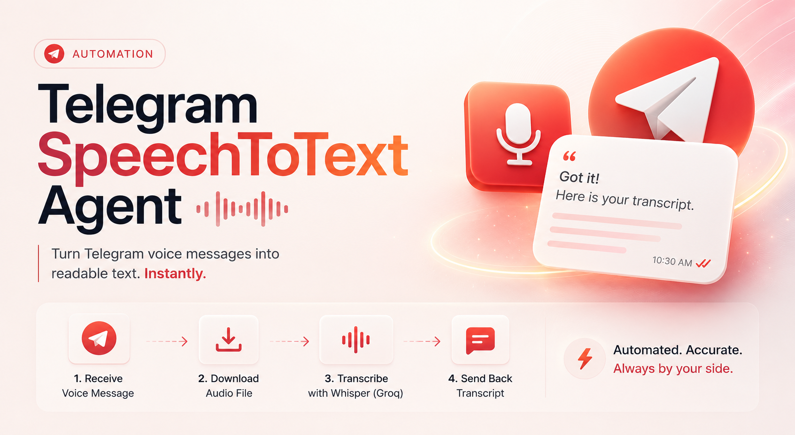

# Speech-To-Text — Telegram Voice Transcription (n8n Workflow)

An n8n automation that listens for voice notes sent to a Telegram bot, transcribes them using Groq's Whisper API, and replies back with the text — running on a self-hosted, local n8n instance tunneled through ngrok.

## Overview

Send a voice note to your Telegram bot → n8n downloads the audio → the file extension is corrected → Groq's `whisper-large-v3-turbo` model transcribes it → the bot replies with the transcript in the same chat.

**Flow:**
`Telegram Trigger → If → Get a file → Code in JavaScript → HTTP Request → Edit Fields → Send a text message`

## Tech Stack

- **n8n** — self-hosted, installed via npm (Windows)
- **Telegram Bot API** — trigger + message delivery
- **Groq API** — `whisper-large-v3-turbo` model (OpenAI-compatible endpoint)
- **ngrok** — local tunnel exposing the n8n webhook over HTTPS (required for Telegram webhooks on localhost)

## Prerequisites

- n8n installed locally and updated to a recent version (`npm install -g n8n`)
- A Telegram bot token from [@BotFather](https://t.me/BotFather)
- A Groq API key from [console.groq.com](https://console.groq.com) with `whisper-large-v3-turbo` enabled for your project
- [ngrok](https://ngrok.com/download) installed and authenticated

## Environment Setup

**1. Start ngrok**
```bash
ngrok http 5678
```
Copy the generated `https://xxxx.ngrok-free.app` URL.

**2. Start n8n with the required environment variables**

Command Prompt:
```bash
set WEBHOOK_URL=https://xxxx.ngrok-free.app/
set N8N_DEFAULT_BINARY_DATA_MODE=memory
n8n start
```

PowerShell:
```powershell
$env:WEBHOOK_URL="https://xxxx.ngrok-free.app/"
$env:N8N_DEFAULT_BINARY_DATA_MODE="memory"
n8n start
```

> `N8N_DEFAULT_BINARY_DATA_MODE=memory` is required — filesystem-mode binary storage causes `ECONNRESET` / buffer errors when sending Telegram voice files to the HTTP Request node.

**3. Import the workflow**
Import `Speech-To-Text.json` into your n8n instance, or rebuild it manually using the node breakdown below.

**4. Add credentials**
- **Telegram account** — using your bot token from BotFather
- **Header Auth account** — Name: `Authorization`, Value: `Bearer YOUR_GROQ_API_KEY`

**5. Activate the workflow**
Toggle the workflow to **Active** in the top-right corner.

## Node-by-Node Breakdown

| # | Node | Type | Purpose |
|---|------|------|---------|
| 1 | **Telegram Trigger** | `telegramTrigger` | Listens for incoming `message` updates |
| 2 | **If** | `if` | Passes through only if `message.voice` exists |
| 3 | **Get a file** | `telegram` (Resource: File, Op: Get) | Downloads the voice note binary via `file_id` |
| 4 | **Code in JavaScript** | `code` | Renames binary from `.oga` → `.ogg` (Groq rejects `.oga`) |
| 5 | **HTTP Request** | `httpRequest` | POSTs audio to Groq's Whisper endpoint for transcription |
| 6 | **Edit Fields** | `set` | Extracts the transcript from the API response |
| 7 | **Send a text message** | `telegram` (Send Message) | Replies to the original chat with the transcript |

### Node 2 — If (voice filter)
```
Condition: {{ $json.message.voice }}  →  Exists
Combinator: AND
```

### Node 3 — Get a file
```
Resource: File
Operation: Get
File ID: {{ $json.message.voice.file_id }}
```

### Node 4 — Code in JavaScript
```javascript
const item = $input.first();

return [{
  json: item.json,
  binary: {
    data: {
      ...item.binary.data,
      fileName: 'audio.ogg',
      fileExtension: 'ogg',
      mimeType: 'audio/ogg'
    }
  }
}];
```

### Node 5 — HTTP Request (Whisper transcription)
```
Method: POST
URL: https://api.groq.com/openai/v1/audio/transcriptions
Authentication: Generic Credential Type → Header Auth
Body (Multipart Form-Data):
  file              → n8n Binary File → Input Data Field Name: data
  model             → whisper-large-v3-turbo
  response_format   → json
```

### Node 6 — Edit Fields (Set)
```
Field name: transcript =
Value: {{ $json.text }}
Type: String
```
> Note: the field name includes a trailing " =" (a naming quirk, not a functional bug). It's referenced downstream as `$json['transcript =']`. Works as-is; can be renamed to a plain `transcript` for cleanliness if desired — just update Node 7's expression to match.

### Node 7 — Send a text message
```
Chat ID: {{ $('Telegram Trigger').item.json.message.chat.id }}
Text: {{ $json['transcript ='] }}
```

## Known Issues & Fixes

| Issue | Cause | Fix |
|-------|-------|-----|
| `Bad request` on Telegram Trigger test | n8n on localhost with no public HTTPS URL | Tunnel via ngrok and set `WEBHOOK_URL` |
| `An HTTPS URL must be provided for webhook` | `--tunnel` flag not applied (common on Desktop App) | Use ngrok + `WEBHOOK_URL` env var instead |
| `data should be a string, Buffer or Uint8Array` | Bug in older n8n versions reading filesystem-mode binaries in HTTP Request | Update n8n **and** set `N8N_DEFAULT_BINARY_DATA_MODE=memory` |
| `file must be one of the following types` | Telegram voice notes are `.oga`; Groq only accepts `.ogg` (and other listed formats) | Rename file extension/mimeType in a Code node before the HTTP Request |
| Whisper models greyed out in Groq project settings | Model not enabled at the organization level | Request org-level access, or switch to OpenAI's `whisper-1` as a fallback |

## Folder Structure

```
├── README.md
├── Speech-To-Text.json
└── Images/
    └── (screenshots of node configuration, if included)
```

## Future Improvements

- Rename the `transcript =` field to a clean `transcript` for readability
- Add error handling / retry logic around the HTTP Request node
- Support longer voice notes by chunking audio before transcription
- Log transcripts to Google Sheets or Supabase for a searchable history
- Add multi-language detection support via Whisper's `language` parameter

## License

MIT — free to use, modify, and share.
